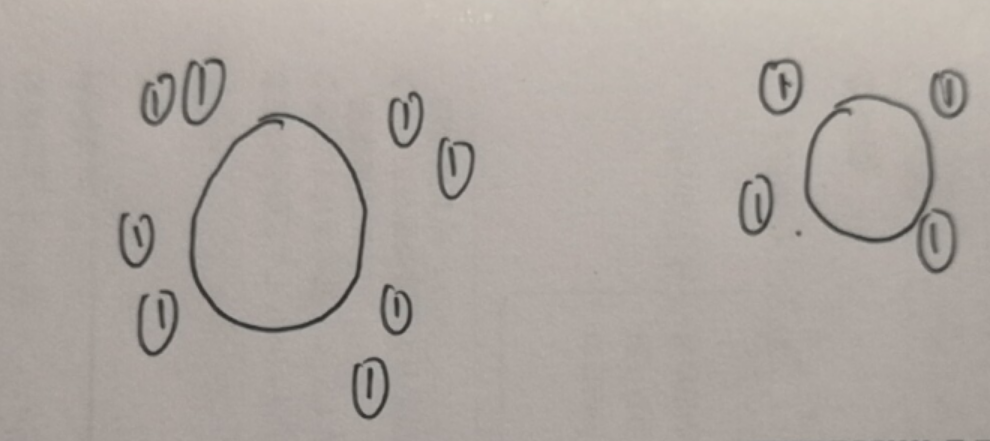

# 第五章 无刷直流电动机控制技术  
## 5.1 无刷直流电动机的结构和工作原理  
### 5.1.1 无刷直流电动机的结构  
大部分无刷直流电机嵌有3个霍尔传感器，当转子永磁体经过霍尔传感器时，传感器会给出一个高电平或者低电平，同一时间只有一个霍尔会被触发
### 5.1.2 无刷直流电动机的霍尔传感器位置检测  
1. 霍尔传感器工作原理
2. 霍尔传感器分类
    (1) 线性性  
    (2) 开关型  
    (3) 锁定型，高于一定值才会判断为正，低于一定值才会判断为负，例：高于5V为正，低于-5V为负，在-5V~5V之间保持原样，和开关型不同的是，开关型是低于3V为负，高于3V为正，这两个阈值大小一样。  
3. 霍尔传感器基本功能  
   用来表示转子大致位置
4. 霍尔位置传感器的设计
    1. 霍尔元件数目的确定  
        主要看有多少相，要用$2^{传感器数目}$表示完$2*传感器数目$
    2. 霍尔元件相隔的位置角  
        同样放n个会有两种不同的位置角，有$360/n$和$180 - 360/n$两种方式
    3. 安装位置  
        会根据实际情况调整
### 5.1.3 无刷直流电动机的工作原理  
首先用两相两极无刷电机来做演示，当定子合成磁动势和转子永磁铁磁场相位相差90度的时候，定子对转子的转矩达到峰值。然后我们会在相差0度的时候，定子对转子的转矩为0的时候换相。  
然后用比较常见的三相电机来说明，这里使用的是三相单极对的电机，核心思路就是，三个霍尔传感器可以判断出转子在60,120,180,240,300,360六个角度中的哪一个。然后当转子转到了其中某个角度就进行换相，换相后的力和转子目前的角度相差30度，所以力的来源是两个定子叠加而成的，所以同一时刻只有两个定子在工作，另一个定子的两个功率开关始终处于关断状态。
### 5.1.4 三相多槽多极对电机结构  
三相单极对还是比较少见的。实际应用中，三相多极对才是主流。用三相四极对作为例子。我们可以看到书中图片定子中有四对NS，我们可以看到图中有八个1，简图如下，然后其中每两个为一进一出的一组，所以在这里简化掉。  
  
我们知道同一时刻，是三相中起作用的其中两相，所以我们可以用剩下的一相的反向来代表另外两相的叠加。我们对应到图中为上图中的那四个1，然后我们控制的下一相为2，然后我们可以看到下一相中2和1的偏移量为360/4/3为30度。然后相应地，磁传感器也如书中图片一样每间隔30度装一个。而且依旧只要装三个就够了，因为磁传感器的主要作用是检测换相时机，磁传感器能检测到现在该换相了就行。
### 5.1.5 无刷直流电动机的双闭环调速系统  
核心是电流环，将速度环的结果和电流采样结果作为输入，输入进电流环，然后输出
