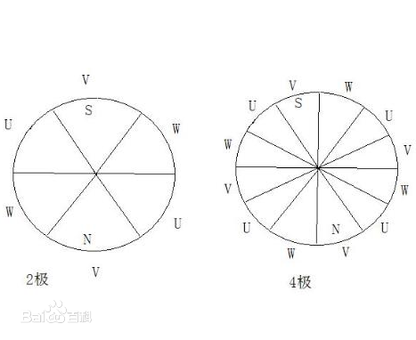

# 第六章 永磁同步电动机控制技术
## 6.1 永磁同步电动控制原理
永磁同步电动机的转子按永磁体结构可以分为
- 表面式永磁同步电动机，属于隐极式
永磁体粘结到转子铁心表面，估计是容易磨损，适用于转子转速低  
有效气隙[1]较大，同步电抗小[2]，电枢反应小  
气隙均匀，即$X_d = X_q$  
- 内置式永磁同步电动机，属于凸极式  
永磁体镶嵌在转子铁心内部，适用于高速运行场合  
有效气隙较小，d轴和q轴的同步电抗较大，电枢反应磁动势较大，从而存在较大的弱磁空间  
  
下面是我们要控制的定子绕组的情况。相数=3，槽数=36，极对数=4，极距=9，每极每相=3，节距=8。[3]和无刷直流电机电动绕组的区别在于采用短距绕组方式和分布绕组方式，来让绕组感应反电动势尽量为正弦波

### 6.1.1 永磁同步电动机的数学模型
列了五条理想化条件，最重要的是电机属于隐极式，我们不考虑另一种电动机
1. 静止坐标系OABC下的数学模型
我对物理没有太大的兴趣，这里一个个公式的推到我没有仔细看，直接列结论了
$$$$

___

附录[1]:电机气隙指的是静止的磁极和旋转的电枢之间的间隙。气隙的大小，决定磁通量的大小，如果气隙较大的话，漏磁就多，那么电机的效率就会降低，如果气隙太小，就容易扫定子膛。因此，需要将气隙控制到一个合理的数值，才能达到最佳效果。小容量电机中，气隙为0.5~3mm。这里有效气隙较大，应该是指因为永磁体贴在表面所以和电枢间隙小，所以气隙较小，漏磁比较少，利用效率高  
  

附录[2]:同步电抗是同步电机的定子漏抗与电枢反应电抗之和  
  

附录[3]:
 
